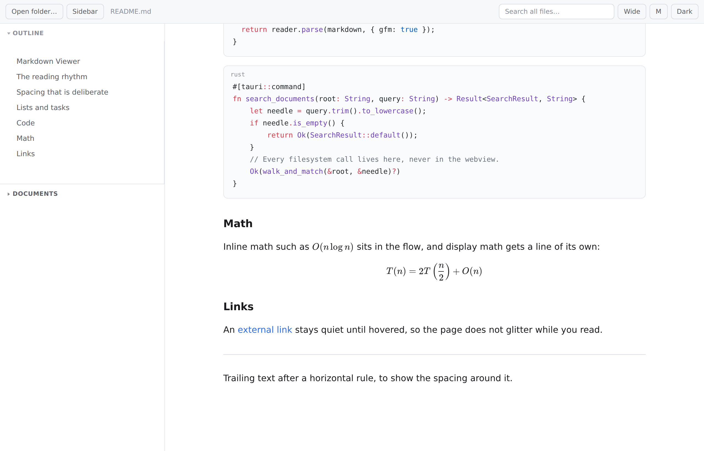

# Markdown Viewer

**English** | [中文](README.zh.md)

[](https://github.com/a2bothic/dsh-mdviewer/actions/workflows/ci.yml)

A lightweight desktop Markdown document viewer: browse a folder of documents
and search their full text, rendered with the reading typography used by the
DeepSeek Harness web GUI.

Built with **Tauri v2** (Rust backend + system webview), so the installer is a
few megabytes rather than the ~100 MB an Electron build would need.


## What it does

- **Folder browsing** — open a folder; every `.md`, `.markdown`, `.mdx`, `.txt`
  under it appears in the sidebar, grouped by directory.
- **Full-text search** — one box searches the whole folder. Results show the
  file, line number, and the matching line with the hit highlighted.
- **Reading typography** — the column, rhythm, and font stack are ported from
  the DeepSeek Harness front end (see [Typography](#typography)).
- **Outline** — built from the document headings, click to jump.
- **Collapsible sidebar** — hide the whole left panel with the *Sidebar* button
  or `Ctrl+B`; the reading column re-centres in the full window width.
- **Show or hide either pane** — the *Outline* and *Documents* buttons (or
  `Ctrl+O` / `Ctrl+D`) remove a pane entirely; hiding the document list leaves
  the outline filling the sidebar, which is what you want while reading.
- **Draggable split** — the sidebar is one column divided into two panes; drag
  the divider to choose how much each gets. The split is remembered, arrow keys
  nudge it, and double-clicking restores the default.
- **Code highlighting, math, tables, task lists** — GitHub-flavoured Markdown
  through marked, Shiki (dual light/dark themes), and KaTeX.
- **Reading controls** — column width, text size, and light/dark theme.
- **Opens files from outside** — set it as the default handler for `.md`, or
  drop a file onto the window. The document's folder becomes the workspace, so
  the sidebar and search cover its neighbours.

Preferences (theme, sidebar state, splitter position) persist in `localStorage`.

Deliberately **not** included: editing, note graphs, sync, plugins, an agent,
or a terminal. This is a viewer.

## In pictures

**Full-text search** — results carry the file, line number, and a highlighted
excerpt; click one to open it.


**Code and math** — Shiki highlighting with dual light/dark themes, and KaTeX
for inline and display equations.


**Either pane can be hidden** — with the document list hidden the outline
fills the sidebar, and the split is restored when it comes back.



**Dark theme** and a **collapsible sidebar** — hiding the panel re-centres the
reading column in the full window width.

| Dark theme | Sidebar collapsed |
|---|---|
|  |  |

## Install

Download the latest installer from the
[releases page](https://github.com/a2bothic/dsh-mdviewer/releases/latest):

| Platform | File | Size |
|---|---|---|
| Windows (installer) | `Markdown.Viewer_0.1.0_x64-setup.exe` | 2.2 MB |
| Windows (MSI) | `Markdown.Viewer_0.1.0_x64_en-US.msi` | 2.7 MB |
| Windows (portable) | `dsh-mdviewer.exe` | 4.2 MB |
| macOS (universal) | `Markdown.Viewer_0.1.0_universal.dmg` | 5.0 MB |
| Linux (Debian) | `Markdown.Viewer_0.1.0_amd64.deb` | 2.9 MB |
| Linux (AppImage) | `Markdown.Viewer_0.1.0_amd64.AppImage` | 78 MB |

The Windows executables are not code-signed, so SmartScreen may warn on first
run: choose **More info** then **Run anyway**.

## Requirements

| | |
|---|---|
| Node.js | 20.19 or newer (24 LTS recommended) |
| pnpm | 9 or newer |
| Rust | stable, 1.77+ |
| Windows | WebView2 runtime (preinstalled on Windows 11 and current Windows 10) |

## Development

```bash
pnpm install
pnpm dev:desktop     # launches the Tauri window with hot reload
```

## Building

```bash
pnpm build:desktop
```

Artifacts land in `src-tauri/target/release/bundle/`:

- Windows — `nsis/*.exe` (installer) and `msi/*.msi`, plus a portable exe under
  `target/release/`
- macOS — `dmg/*.dmg`
- Linux — `deb/*.deb`, `appimage/*.AppImage`

To build a **Windows** binary you must run the build on Windows; cross-compiling
a Tauri app from WSL needs the MSVC toolchain and is not supported out of the box.

### Windows build notes

Two things bite on a fresh Windows machine, neither of which is a code problem:

1. **`cargo` must be on `PATH`.** Tauri shells out to `cargo metadata`, and the
   rustup installer does not always add `%USERPROFILE%\.cargo\bin` to the
   environment of every shell. If the build fails with

   ```
   failed to run 'cargo metadata' ... program not found
   ```

   prepend the directory for that session:

   ```powershell
   $env:PATH = "$env:USERPROFILE\.cargo\bin;$env:PATH"
   pnpm build:desktop
   ```

2. **`bundle.targets` must be `"all"`, not an explicit cross-platform list.**
   Naming `dmg`, `deb`, or `appimage` while building on Windows makes Tauri
   abort the whole bundle step. `"all"` builds whichever formats are valid for
   the host platform, which is what you want on every OS.

## Typography

The reading column replicates the DeepSeek Harness markdown tokens rather than
using browser defaults, because those are what make a document comfortable to
read. The values live in `src/styles/tokens.css` and `src/styles/typography.css`:

| Token | Value | Why |
|---|---|---|
| Body line height | fixed `24px` | A fixed pixel rhythm, not a ratio, so text size changes scale evenly |
| Paragraph gap | `16px` | Two thirds of the line height — paragraphs group instead of drifting |
| Heading gap | `32px` above, `16px` below | Asymmetric, so a heading binds to the content beneath it |
| List indent | `18px` | Much tighter than the browser default of ~40px |
| List item gap | `6px` | Small, but clearly improves scanning |
| Horizontal rule | `0.5px` | A hairline, not a divider |
| Bold weight | `600` | Not `700`, which reads as too heavy in body text |
| Inline code | `.875em` | Monospace looks larger at the same size; this equalises the optical weight |

The font stacks also put the CJK families **before** `sans-serif`, which keeps
Chinese and English on a consistent baseline:

```css
--font-sans: -apple-system, BlinkMacSystemFont, "Segoe UI", "PingFang SC",
             "Hiragino Sans GB", "Microsoft YaHei", "Helvetica Neue",
             Helvetica, Arial, sans-serif;
```

Adjust `--base-size` and `--measure` to change the default text size and column
width; the derived rhythm recalculates automatically.

## Architecture

```
src/
  main.ts              application shell, sidebar, toolbar, search UI
  lib/api.ts           typed wrappers over the Rust commands
  lib/render.ts        Markdown pipeline (marked + Shiki + KaTeX + DOMPurify)
  styles/tokens.css    design tokens (fonts, colours, rhythm)
  styles/typography.css  the reading-column rules
  styles/app.css       shell layout
src-tauri/
  src/lib.rs           scan_folder / read_document / search_documents / pick_folder
```

All filesystem access lives in Rust, so the webview never touches the disk
directly and the CSP can stay strict. There is no IPC surface for writing.

### Rendering order

Order matters in `render.ts`:

1. Fenced code is lifted out, so `$` inside code is never read as math.
2. `$…$` and `$$…$$` are rendered to KaTeX HTML and replaced with placeholder
   tokens, so emphasis rules cannot eat formula characters.
3. marked parses the rest.
4. DOMPurify sanitises, with KaTeX's tags and attributes allowed through.
5. The KaTeX HTML is restored.

## Tests

```bash
bash scripts/check.sh                     # typecheck + build + Rust tests + browser checks
node test/visual-check.mjs                # 47 checks in a real Chromium against the built bundle
python3 src-tauri/test-search-window.py   # search highlight offset correctness
```

The visual check drives the actual production bundle with a mocked Tauri bridge
and asserts both the DOM and the computed typography (line height, gaps, list
indent, column width), so a CSS regression fails the suite. Screenshots are
written to `test-output/`.

The Rust unit tests cover the search logic: scan filtering, skipped directories,
relative paths, line numbers, **highlight offsets** (including CJK and truncated
long lines), and the result cap.

## Licence

MIT
