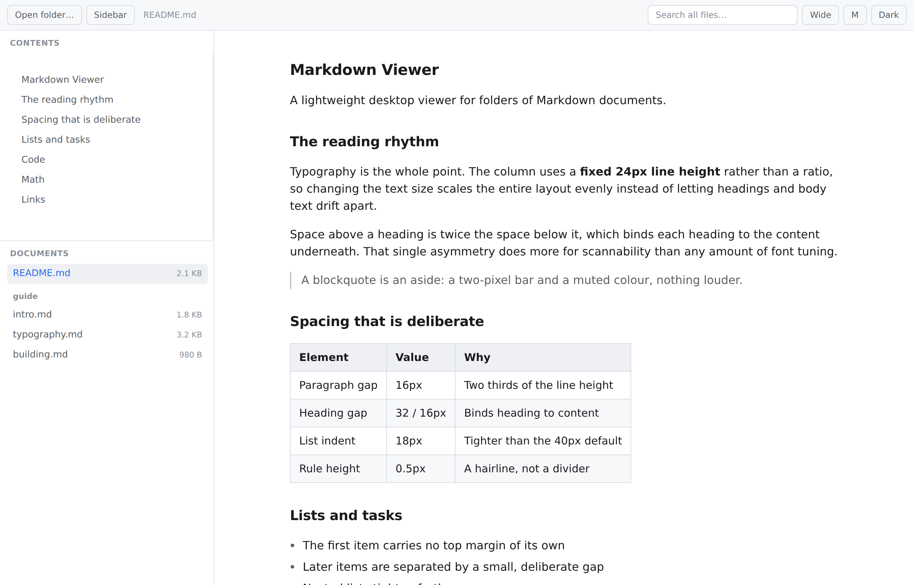
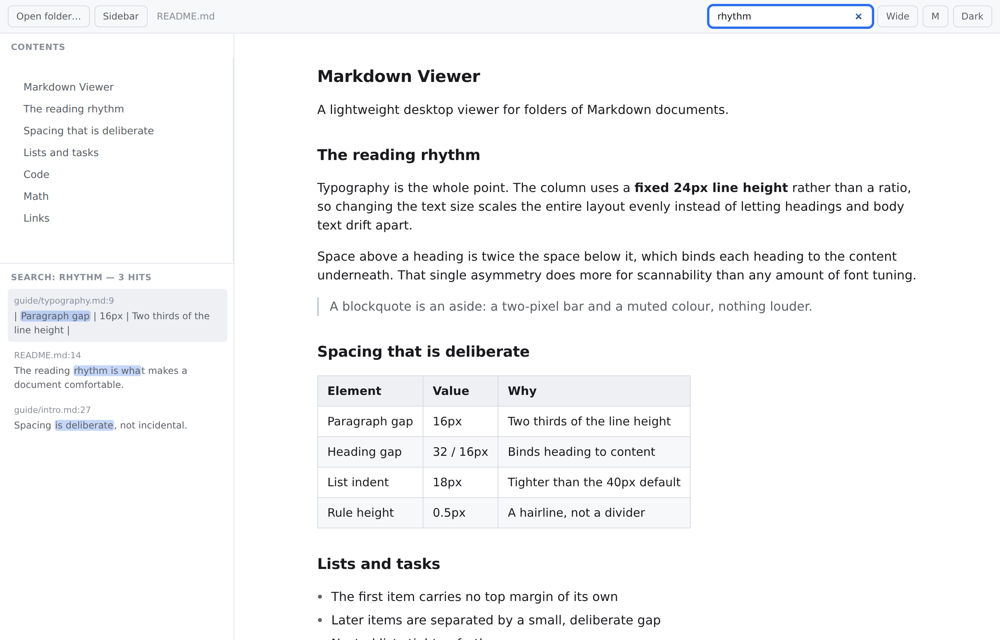
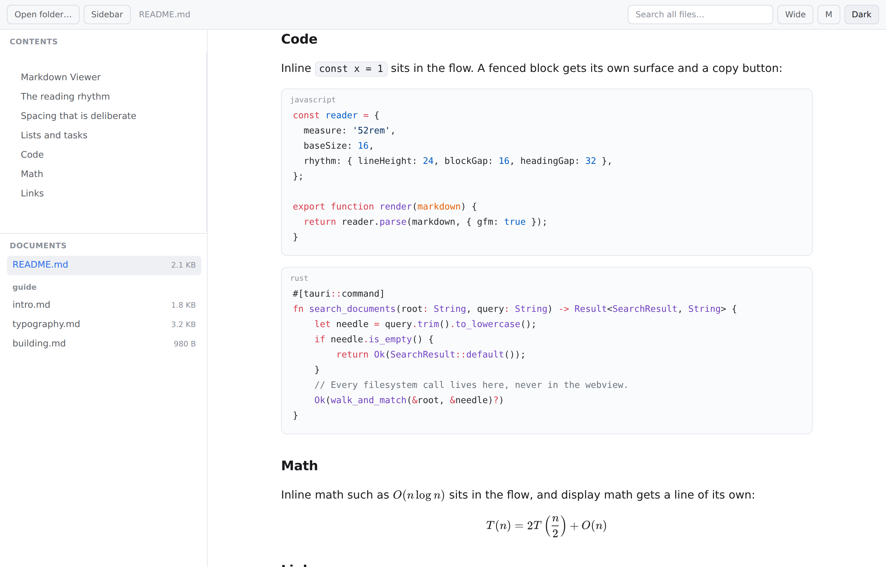
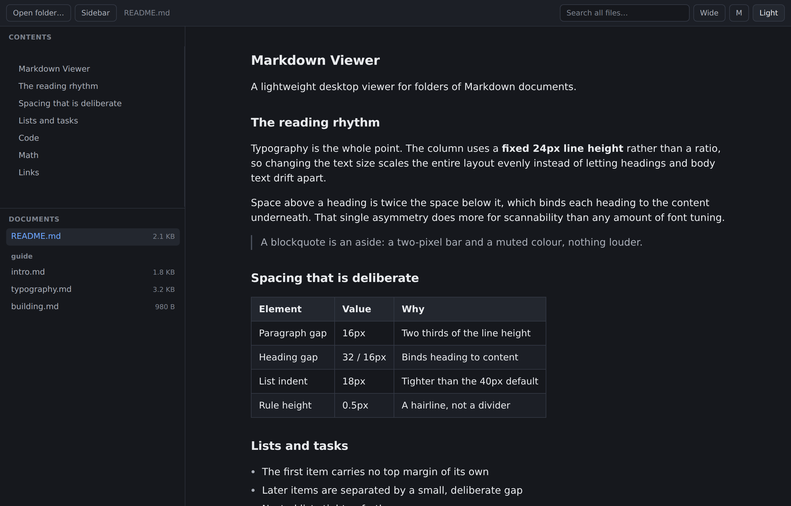
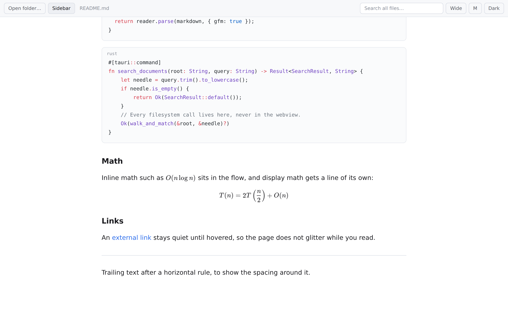

# Markdown Viewer

[English](README.md) | **中文**

[](https://github.com/a2bothic/dsh-mdviewer/actions/workflows/ci.yml)

一个轻量的桌面 Markdown 文档浏览器：打开一个文件夹，浏览其中的文档并做全文搜索，
排版沿用 DeepSeek Harness Web GUI 的阅读样式。

基于 **Tauri v2**（Rust 后端 + 系统自带 WebView）构建，因此安装包只有几 MB，
而 Electron 方案需要约 100 MB。



## 功能

- **文件夹浏览** —— 打开一个文件夹，其下所有 `.md`、`.markdown`、`.mdx`、`.txt`
  都会按目录分组显示在侧边栏。
- **全文搜索** —— 一个输入框搜索整个文件夹，结果带上文件名、行号和匹配行高亮。
- **阅读排版** —— 行宽、间距节奏和字体栈移植自 DeepSeek Harness 前端
  （见[排版](#排版)）。
- **目录导航** —— 根据文档标题自动生成，点击跳转。
- **侧边栏可收起** —— 点 *Sidebar* 按钮或按 `Ctrl+B` 收起整个左侧面板，
  文档区会在整个窗口宽度内重新居中。
- **面板可拖动** —— 拖动 Contents 和 Documents 之间的分隔条调整各自占比，
  聚焦后用方向键微调。
- **代码高亮、公式、表格、任务列表** —— 通过 marked、Shiki（明暗双主题）
  和 KaTeX 支持 GitHub 风格 Markdown。
- **阅读控制** —— 列宽、字号、明暗主题。

偏好设置（主题、侧边栏状态、分隔条位置）保存在 `localStorage` 中。

**刻意不做**的功能：编辑、笔记双链、同步、插件、Agent、终端。这是一个纯粹的阅读器。

## 界面一览

**全文搜索** —— 结果带上文件名、行号和高亮片段，点击即可打开。



**代码与公式** —— Shiki 高亮，明暗双主题；公式由 KaTeX 渲染。



**暗色主题**与**可收起的侧边栏** —— 收起后文档区在整个窗口宽度内重新居中。

| 暗色主题 | 侧边栏收起 |
|---|---|
|  |  |

## 环境要求

| | |
|---|---|
| Node.js | 20 或更高 |
| pnpm | 9 或更高 |
| Rust | stable，1.77+ |
| Windows | WebView2 运行时（Windows 11 及较新的 Windows 10 已预装） |

## 开发

```bash
pnpm install
pnpm dev:desktop     # 启动 Tauri 窗口，支持热重载
```

## 构建

```bash
pnpm build:desktop
```

产物位于 `src-tauri/target/release/bundle/`：

- Windows —— `nsis/*.exe`（安装包）和 `msi/*.msi`，另有免安装 exe 在
  `target/release/`
- macOS —— `dmg/*.dmg`
- Linux —— `deb/*.deb`、`appimage/*.AppImage`

构建 **Windows** 版本必须在 Windows 上进行；从 WSL 交叉编译 Tauri 应用需要
MSVC 工具链，开箱不支持。

### Windows 构建注意事项

在新装的 Windows 机器上有两个坑，都不是代码问题：

1. **`cargo` 必须在 `PATH` 中。** Tauri 会调用 `cargo metadata`，而 rustup
   安装器不一定会把 `%USERPROFILE%\.cargo\bin` 加进所有 shell 的环境变量。
   如果报错：

   ```
   failed to run 'cargo metadata' ... program not found
   ```

   在当前会话中把该目录加到最前面：

   ```powershell
   $env:PATH = "$env:USERPROFILE\.cargo\bin;$env:PATH"
   pnpm build:desktop
   ```

2. **`bundle.targets` 必须写 `"all"`，不能写明确的跨平台列表。**
   在 Windows 上构建时如果列了 `dmg`、`deb` 或 `appimage`，Tauri 会中止整个
   bundle 步骤。写 `"all"` 表示按当前平台选择合法格式，这才是各系统都正确的写法。

## 排版

阅读区没有沿用浏览器默认样式，而是复刻了 DeepSeek Harness 的 markdown token，
因为这些参数才是"读着舒服"的关键。具体值在 `src/styles/tokens.css` 和
`src/styles/typography.css`：

| 项目 | 取值 | 原因 |
|---|---|---|
| 正文行高 | 固定 `24px` | 用固定像素而非比例，改字号时节奏整体等比缩放 |
| 段间距 | `16px` | 行高的三分之二 —— 段落成组，而不是散开 |
| 标题边距 | 上 `32px`、下 `16px` | 非对称，让标题归属于其下方的内容 |
| 列表缩进 | `18px` | 比浏览器默认的约 40px 紧凑很多 |
| 列表项间距 | `6px` | 很小，但明显提升扫读效率 |
| 分隔线 | `0.5px` | 发丝线，而不是一道分割 |
| 加粗字重 | `600` | 不用 `700`，后者在正文里显得过重 |
| 行内代码 | `.875em` | 等宽字体在同样字号下视觉偏大，缩到 87.5% 才等重 |

字体栈还把中文字体放在 `sans-serif` **之前**，这样中英文基线保持一致：

```css
--font-sans: -apple-system, BlinkMacSystemFont, "Segoe UI", "PingFang SC",
             "Hiragino Sans GB", "Microsoft YaHei", "Helvetica Neue",
             Helvetica, Arial, sans-serif;
```

调整 `--base-size` 和 `--measure` 即可改变默认字号和列宽，
派生出的整套节奏会自动重算。

## 架构

```
src/
  main.ts             应用外壳：侧边栏、工具栏、搜索界面
  lib/api.ts          Rust 命令的类型化封装
  lib/render.ts       Markdown 渲染管线（marked + Shiki + KaTeX + DOMPurify）
  styles/tokens.css   设计 token（字体、颜色、节奏）
  styles/typography.css  阅读区规则
  styles/app.css      外壳布局
src-tauri/
  src/lib.rs          scan_folder / read_document / search_documents / pick_folder
```

所有文件系统访问都在 Rust 侧完成，WebView 不直接接触磁盘，
因此 CSP 可以保持严格，IPC 层也不存在任何写接口。

### 渲染顺序

`render.ts` 中的顺序是刻意安排的：

1. 先把围栏代码块提取出来，代码里的 `$` 才不会被当成数学公式。
2. 把 `$…$` 和 `$$…$$` 渲染成 KaTeX HTML 并替换为占位符，
   避免强调语法吃掉公式字符。
3. marked 解析剩余内容。
4. DOMPurify 净化，同时放行 KaTeX 所需的标签和属性。
5. 把 KaTeX HTML 还原回去。

## 测试

```bash
bash scripts/check.sh                     # 类型检查 + 构建 + Rust 单测 + 浏览器测试
node test/visual-check.mjs                # 在真实 Chromium 中针对构建产物跑 47 项检查
python3 src-tauri/test-search-window.py   # 搜索高亮偏移的正确性
```

浏览器测试用模拟的 Tauri 桥接驱动**真实的生产构建产物**，同时断言 DOM 和
**计算后的排版值**（行高、间距、列表缩进、列宽），所以 CSS 一旦回归就会失败。
截图输出到 `test-output/`。

Rust 单测覆盖搜索逻辑：扫描过滤、目录跳过、相对路径、行号、**高亮偏移**
（含中文与超长行截断）、结果数量上限。

## 许可证

MIT
